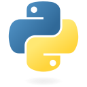
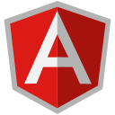

### Hi, I'm Ned

<h4 >A developer from <a href="https://www.youtube.com/watch?v=Vg8LgVOrx6k">Colombia </a> 🇨🇴, passionate about performance code, building devices and solutions, I love new challenges.</h4>

- 🤖 I'm currently learning Express and Databases
- 💬 Ask me about **JS, Python, Microcontrollers**
- 🔨 In my free time I am working in [this...](https://nedzib.github.io/Kamishibai/)

	
:rocket:&nbsp;&nbsp;&nbsp;<b>Skills <small>(Tap here)</small> </b>

	 
	
  

	
🤖&nbsp;&nbsp;&nbsp;<b>Programming Languages</b>

    
    

       
      
      
          
    

  

  
  

	
🖌️&nbsp;&nbsp;&nbsp;<b>Frontend Development</b>

    
    

      
       
      
    

  
  
     
  

	
🗄️&nbsp;&nbsp;&nbsp;<b>Database</b>

    
   

      
     
   

  
     
  

	
📉&nbsp;&nbsp;&nbsp;<b>Data Visualization</b>

    
   

    
    
   

  
       

  

	
☁️&nbsp;&nbsp;&nbsp;<b>Backend as a Service(BaaS)</b>

    
   

    
   

  
       
  

	
⚙️&nbsp;&nbsp;&nbsp;<b>Framework</b>

    
 

  
 

  
       
  

	
🐧&nbsp;&nbsp;&nbsp;<b>Other</b>

    
    

      
           
    

  
     
  

---
**Other projects on:**

---
**Find me on:**

